# BEAT LIBRARY HOME PAGE

The first view of the Beat Library website appears here. And after that when clicking any of worflows jquery-javascript frontend with python backend show up functions work comes.
Beat Library work is home page is admin panel all of beats for jquery-javascript with adding and removing functions.

All of beats upload in the home page afterwise when any of beat is play jquery-javascript frontend with backend python among synchronized workflows shot out it. Beat's Name, Genre, Mood and BPM data transferring.

 

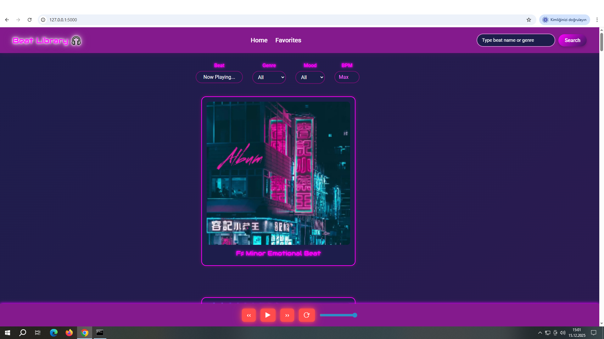
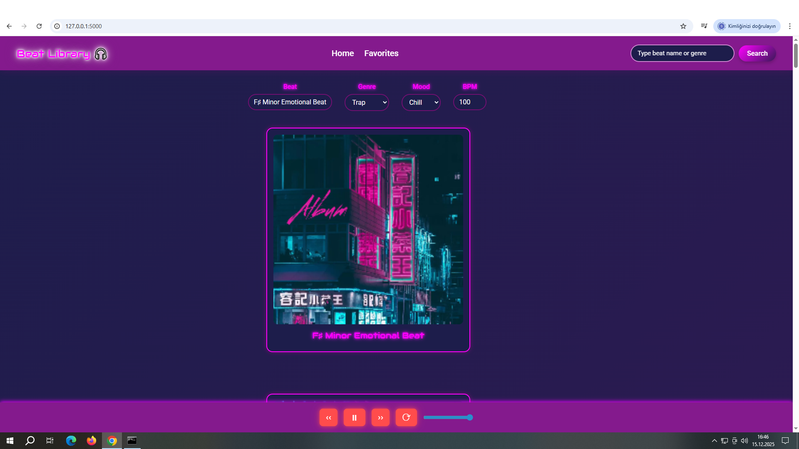

  

## BEAT INTRODUCTION

If any beat type is entered into the search cursor the beats belonging to that type are displayed on the screen in a list below. And when any beat is clicked it shows the beat's name, type, mood, and BPM data.

 

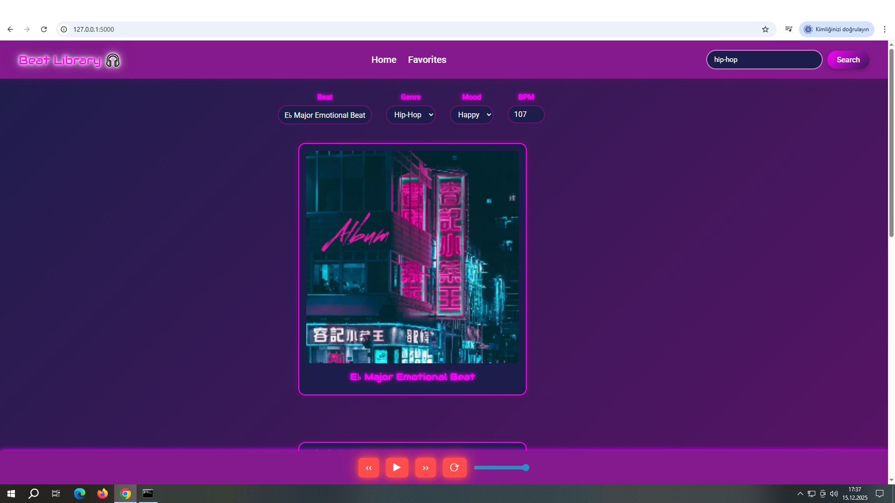

  

## BEAT BPM

If there are multiple beats with the same BPM number the screen will display them and after clicking on a beat it will show its name, genre, mood and bpm.

 

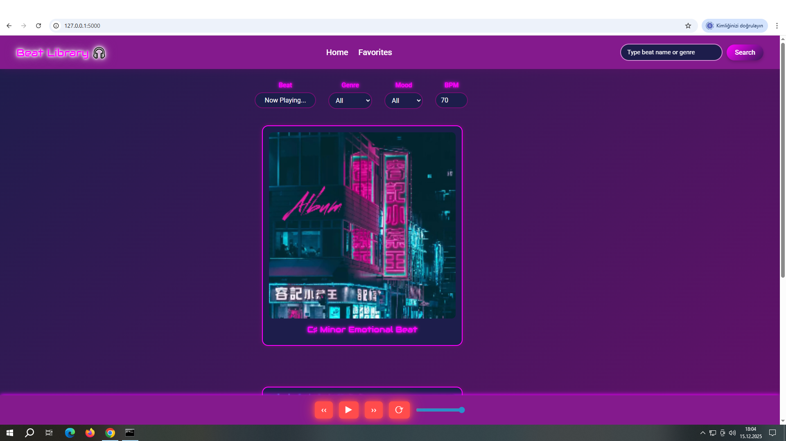

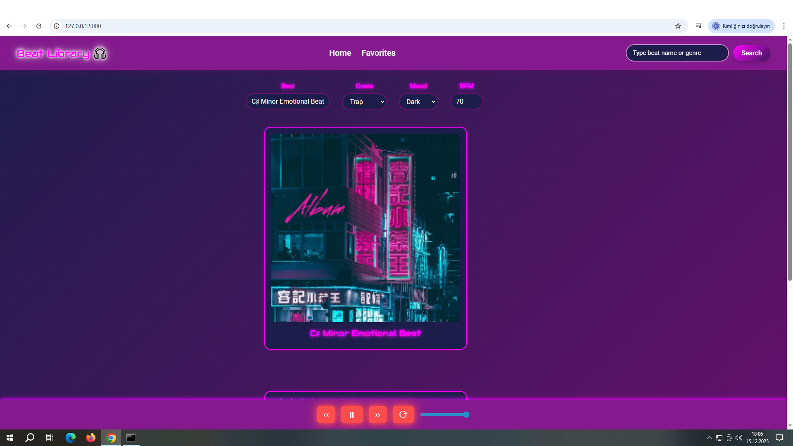

  

## REPLAY BUTTON

When any beat is clicked if desired the same beat can be listened to continuously using the replay button and after the replay button is clicked it gains a dark color appearance on the same tone.

 

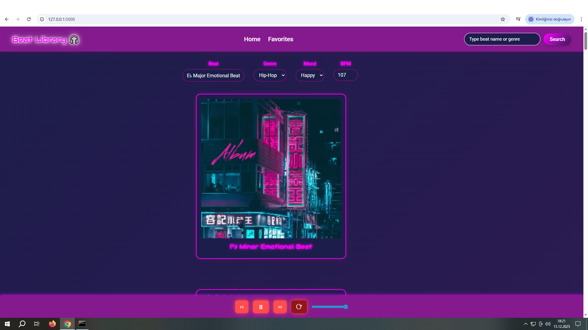

  

## SEARCH SECTION

If any beat name is written exactly into the beat search field it brings that beat to the screen as a single result for the user and at the same time the beat's name, genre, mood, and BPM data are also shown.

 

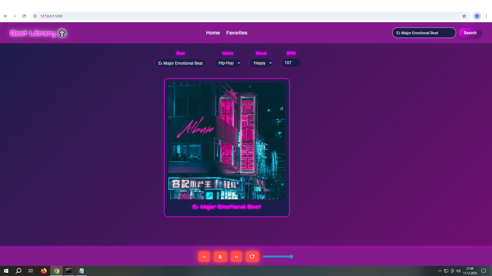

  

## NO RESULTS FOUND

If a beat name or genre that does not exist on the platform meaning is not available on the website is entered a warning is given. And the user is reminded that it is a wrong entry.

 

  

# BEAT LIBRARY FAVORITES PAGE

The Favorites page is under the control of other users and the user can add any desired beat to the favorites list by typing the beat name and then clicking the add button.

In the Selection section all added beats accumulate there and beats can be added to the favorites list in an unlimited way. In the Remove beats section the beat name is written exactly and then removed from the list.

As seen, this page is completely outside the administrator control and allows usage under the control of another user. Importance is given to individual usage.

 

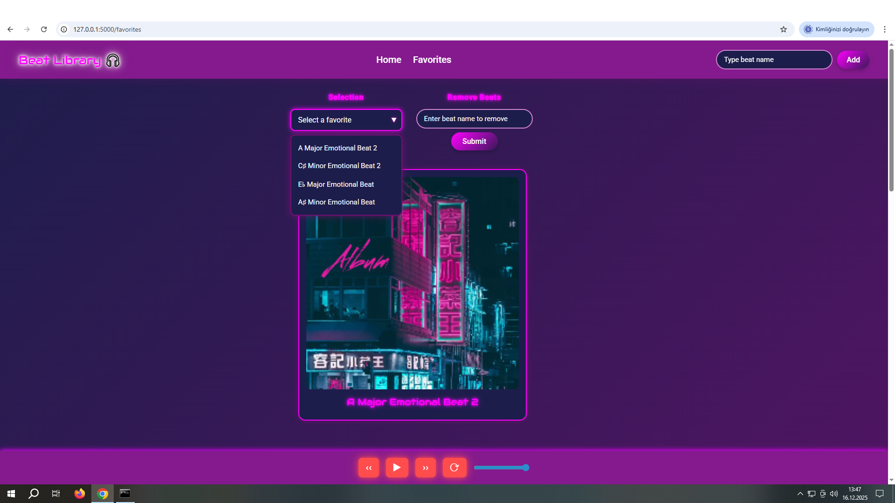

  

## REMOVE BEATS

In the Remove beats section after typing any beat name exactly and clicking the submit button any user can remove the desired beat from their own page.

 

  

## ALERTS

If no beat name is entered and the add button is clicked it gives a "please type beat name" warning.

If the submit button is clicked to remove any beat without entering a beat name it gives a "please enter a beat name" warning.

If the same beat name is entered again unintentionally it gives a "this beat is already added" warning.

If a beat name that does not belong to the platform is entered to be added it gives a "failed to add beat to favorites" warning.

If the beat name you want to remove is entered incorrectly it gives a "this beat is not in your favorites" warning.

 

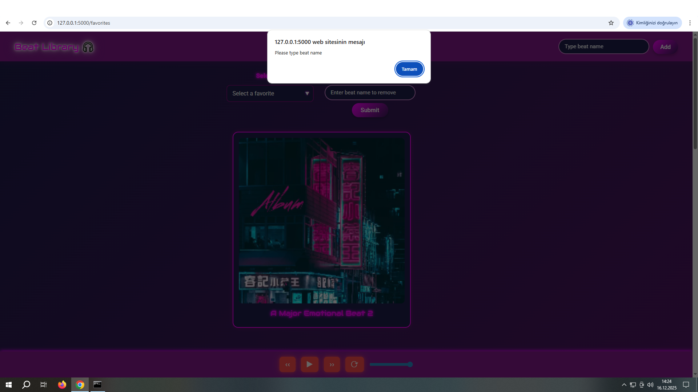

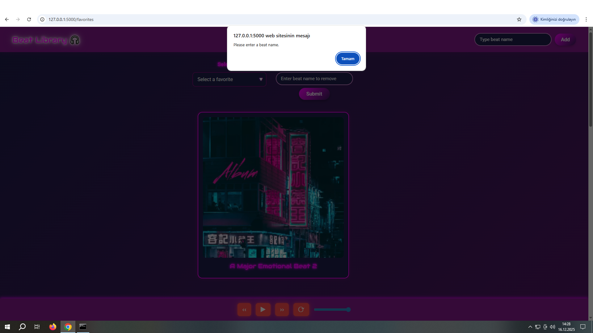

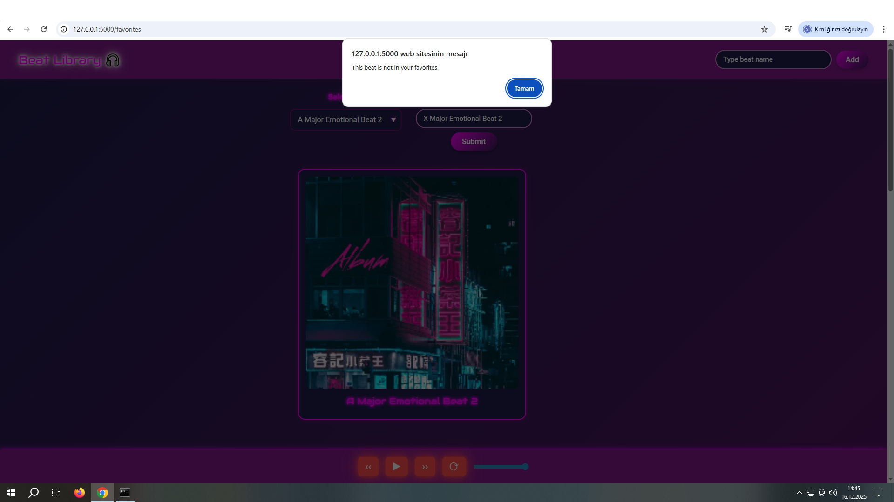

  

## BACKEND FUNCTIONALLY

On the Python backend side first the beats are introduced so that other users can add the beats to their own lists on the favorites page.

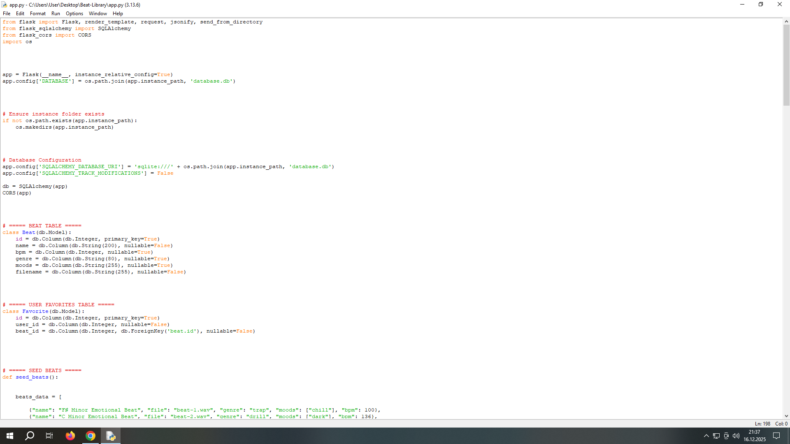

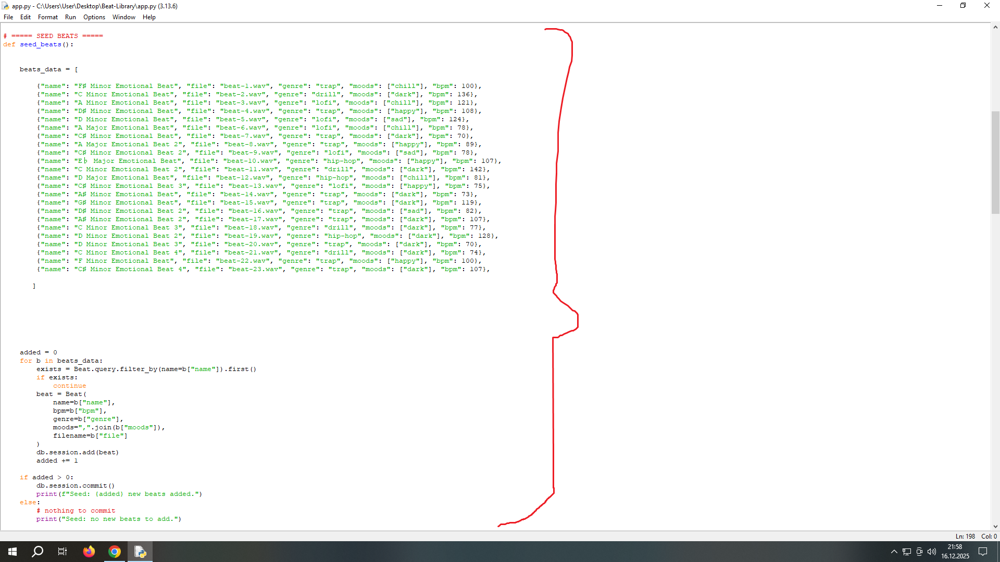

  

In the API endpoints section beat additions are made with permission given by the admin (administrator) so that other users can add beats to their own favorites lists in a unique way. If a beat is not added to this section another user cannot add it to their own account and list.

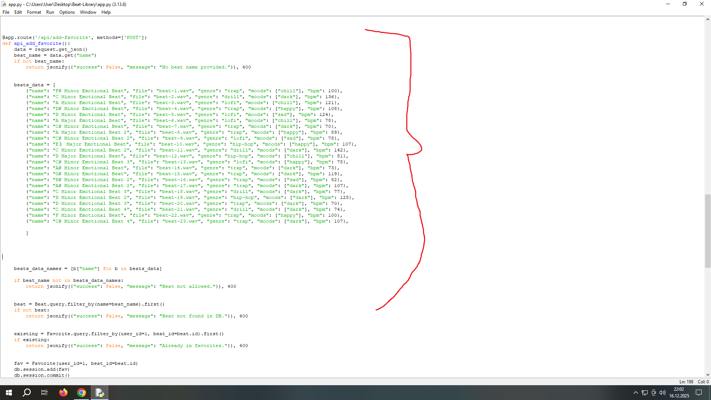
